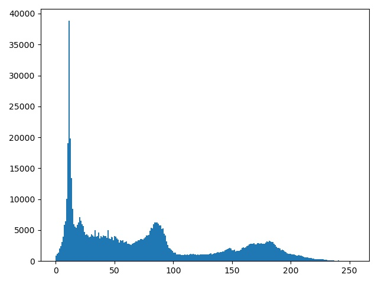

Converting an RGB Image to Grayscale
================
Griffin Going

# Methodology

To convert an RGB image to grayscale, we need only convert the pixel
values to a single flat value, as opposed to the \[red, green, blue\]
format we have when working in RGB images. This is done using the
following formula:

    grayscale pixel = (.3 * red value) + (.59 * green value) + (.11 * blue value)

Performing this operation for each pixel and replacing the old RGB pixel
value with this new grayscale value will render a grayscale image as
shown below. Note that the current function is not parameterized (the
file path is hard-coded), but this could of course easily be done
assuming we had the desire to do so.

# Source Code

    import numpy as np
    import matplotlib.pyplot as plt
    import matplotlib.image as mpimg
    import cv2
    
    
    print("Loading image...")
    img = cv2.imread('convertThis.jpg')
    
    '''
    For each pixel in the RGB image, the correlating pixel in 
    the grayscale image will be the result of the following:
    grayscale pixel = (.3 * red value) + (.59 * green value) + (.11 * blue value)
    
    '''
    print("Converting image...")
    i = 0
    for group in img:
        k = 0
        for pixel in group:
            #print(pixel)
            new = (.3 * pixel[0]) + (.59 * pixel[1]) + (.11 * pixel[2])
            img[i][k] = new
            k = k + 1
        i = i + 1
        
    
    '''
    Save the new grayscale image
    '''
    print("Saving img...")
    cv2.imwrite('gray.jpg', img)
    
    '''
    Create a histogram of the pixel values. ravel() function
    simply flattens the pixel array.
    '''
    print("Creating plots...")
    fig, axs = plt.subplots(1, 1, sharey=True, tight_layout=True)
    axs.hist(img.ravel(), bins=255)
    
    '''
    Save the histogram
    '''
    print("Saving plot...")
    plt.savefig('hist.jpg')
    
    print("Done...")

# RGB Image

# Grayscale Output Image

# Grayscale Image Pixel Value Histogram

